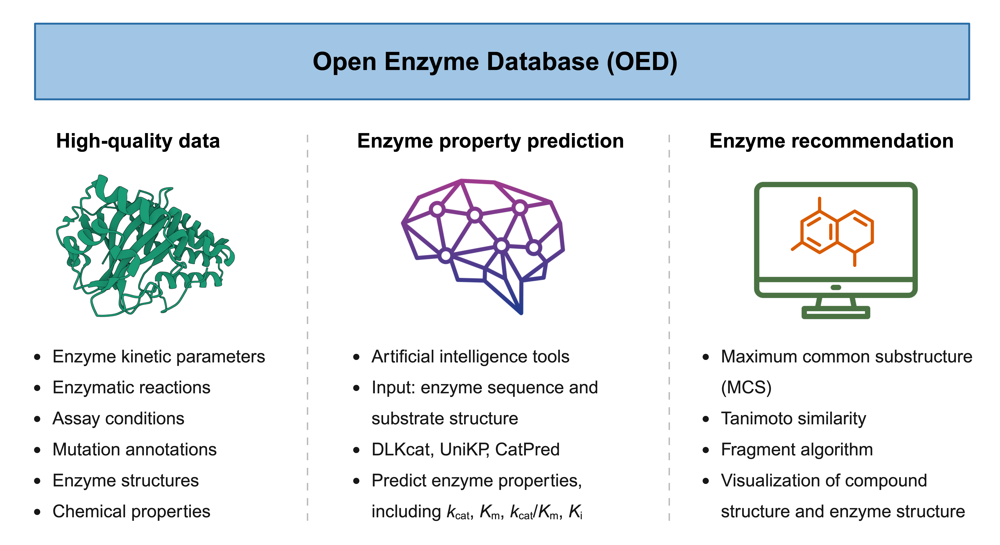

# [**OED**](https://openenzymedb.platform.moleculemaker.org/home) 

<!-- 

  

 -->

## Introduction

The **Open Enzyme Database (OED)** is a community-driven resource developed for researchers and professionals in biochemistry, molecular biology, enzymology, protein and metabolic engineering, and related fields. As a unified web-based platform for exploring enzyme data, OED provides curated information on enzyme kinetic parameters, structural data, and functional annotations. It also features state-of-the-art AI models for enzyme property prediction and cheminformatics-powered enzyme recommendations, with ongoing expansion to incorporate additional enzyme-related data such as enzyme solubility, stability, specificity, functions, and beyond.

## Repository Structure

OED/
├── code/                 # Python scripts
├── complementaryData/    # Complementary datasets
├── data/                 # Main datasets
├── figures/              # Figures for visualizations
├── LICENSE.md            # License information
├── picture/              # Images for OED overview
├── plot/                 # Scripts for generating plots
├── README.md             # Project README file
└── requirements.txt      # Python dependencies

## Citation

If you use **OED** in your research, please cite:

> Le Yuan, David M. Bianchi, Katherine Arneson, Bingji Guo, Sara Lambert, Chris Stephens, Yash H. Wasnik, Christopher Pond, Matthew J. Berry, and Huimin Zhao. (2025). **Open Enzyme Database: A Community-wide Repository for Sharing Enzyme Data.** Nucleic Acids Research. (Under Review)

## Contact

-   Le Yuan ([@le-yuan](https://github.com/le-yuan)), University
    of Illinois Urbana-Champaign, Urbana, IL, USA

